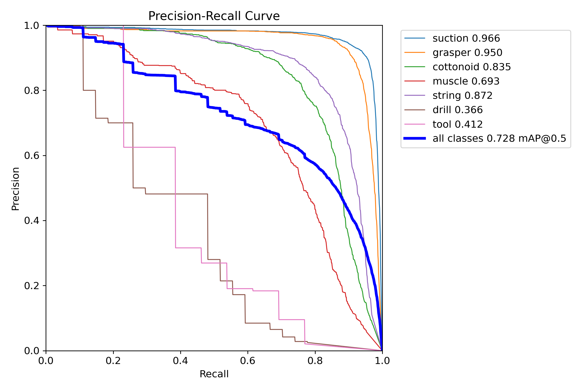

# SOCAL Dataset YOLOv8 Training Results

This repository contains the training results of a YOLOv8n model on the SOCAL dataset, which includes endoscopic surgical videos with 31,443 annotated frames across 147 trials.

## Training Configurations

### Training on Mac (CPU, Batch Size 4)
The model was trained for 50 epochs on a Mac with a CPU.

#### Contents
- Directory: `train/`
- `results.csv`: Training and validation metrics for each epoch.
- `weights/`: Model weights (`best.pt` and `last.pt`).
- `plots/`: Validation plots including confusion matrix, F1 curve, precision-confidence curve, precision-recall curve, and recall-confidence curve.
- `args.yaml`: Training arguments used.

#### Key Metrics (Epoch 50)
- Precision: 0.73438
- Recall: 0.57335
- mAP50: 0.6283
- mAP50-95: 0.4643

#### Notes
- The model struggles with rare classes like `scalpel` and `drill` due to class imbalance.
- Training took approximately 82 hours on a CPU.

### Training on Google Colab (GPU, Batch Size 16)
The model was retrained for 50 epochs on Google Colab using an NVIDIA T4 GPU with a larger batch size of 16 to improve training stability and performance.

#### Contents
- Directory: `train_batchsize_large/`
- `results.csv`: Training and validation metrics for each epoch.
- `weights/`: Model weights (`best.pt` and `last.pt`).
- `plots/`: Validation plots including confusion matrix, F1 curve, precision-confidence curve, precision-recall curve, and recall-confidence curve.
- `args.yaml`: Training arguments used.

#### Key Metrics (Epoch 50)
- Precision: 0.78
- Recall: 0.6544
- mAP50: 0.7148
- mAP50-95: 0.5476

#### Precision-Recall Curve

#### Notes
- Training with a larger batch size and GPU acceleration improved all key metrics compared to the CPU training.
- Training took 2.515 hours for 50 epochs, significantly faster than the CPU training (82 hours).
- The model still struggles with rare classes like `scalpel` and `drill`, but performance improved slightly due to better training dynamics.

